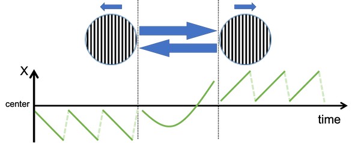
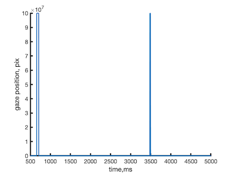
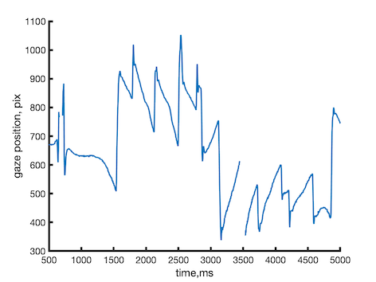
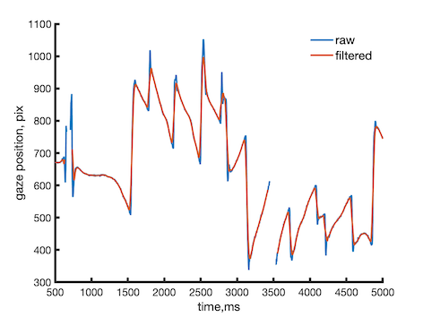
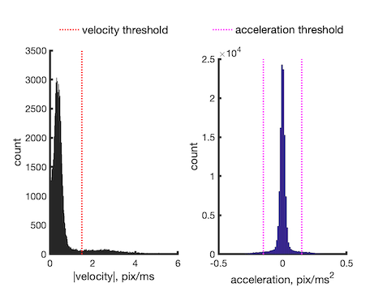
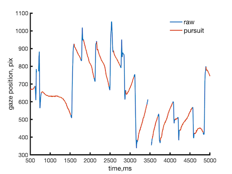
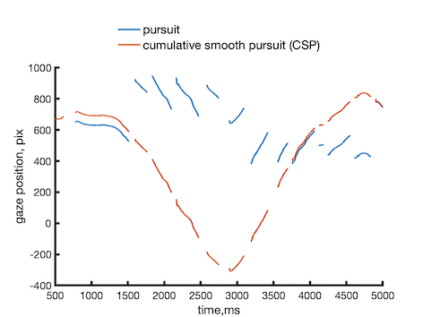
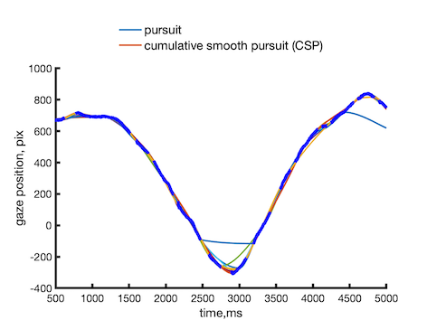
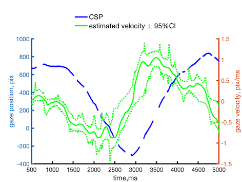

# Cumulative smooth pursuit analysis of BR-OKN
This repository contains supplementary information to "Perceptual reversals in binocular rivalry: improved detection from OKN", by Gergo Ziman, Stepan Aleshin, Ilona Kovacs, and Jochen Braun (Journal of Vision, 2019, LINK)

## Citing
If you use the code from this repo in a publication you can thus cite it using the following:
????i??. <details><summary>BibTex</summary>
<p>

#### ????
<p>  
</details>


# Introduction
**Binocular rivalry (BR)** is observered under conditions of dichoptic stimulation, in other words, of viewing different images with each eye.  Typically, the subjective perception of such a display alternates spontaneously between left-eye-image and  right-eye-image.  Most studies of this phenomenon rely on volitional reports, that is, on observers reporting their subjective experience as rapidly and faithfully as possible. 

However, volitional reports suffer from several limitations:
1. Volitional reports cannot be produced at short intervals.
2. It is difficult to establish the underlying subjective criteria.
3. Volitional reports require trained, healthy, and cooperative observer. 
4. Volitional reports generate additional neural activity, potentially obscuring neural activity related to perceptual processing.

An alternative to volitional reports are so-called **‘no-report’ paradigms**. The most established ‘no-report’ paradigm relies on **optikinetic nystagmus (OKN)** induced by horizontal display motion.  When BR is induced by opposite horizontal motion -- i.e., left and right eyes viewing horizontal motion in opposite directions -- the smooth pursuit phases of OKN typically reflect the perceived direction of motion (Fraessle et al,, 2014; Fujiwara et al., 2017). 




Typically, the recorded eye velocity is processed and filtered to extract the **slow (‘pursuit’)** phase of OKN and slow velocity is categorized in a binary fashion, such as to identify periods with a consistent direction of perceived motion (‘dominance periods’)(Fraessle et al,, 2014; Fujiwara et al., 2017). While this approach reliably identifies long dominance periods, shorter periods of either dominance or transition are more difficult to resolve.

In this repository we provide a MatLab code used in our paper [Perceptual reversals in binocular rivalry: improved detection from OKN](??). The improved analysis yields a continuous record of **‘cumulative smooth pursuit’ (CSP)** comprising an uninterrupted sequence of eye velocity estimates.  This sequence of estimates (with confidence limits) seamlessly joins pursuit periods and interpolated periods. The sequence of velocity estimates can be parsed into distinct phases of ‘pursuit dominance’ and **‘pursuit transitions’**.

# Data import and cleaning
In this example we will use measurements of left eye horizontal position recorded with an Eyelink 1000 (SR Research Ltd, Ottawa, Canada), with temporal sampling of 1kHz. 

```matlab
close all
clear all
clc
load('demo.mat');
time = [1:numel(gx)];
```

Raw recordings are typically contaminated by off-scale artefacts, from eye blinks or signal losses, in which nominal gaze position falls outside the display area.



The following steps remove such off-scale events, together with the adjoining 50 ms on either side, from the eye position record.

```matlab
displaySize = [0 1200]; % x coordinates of the screen
timeKernel = 50; % time kernel for the whole procedure
gx_clean = removeOffscale(gx,displaySize,timeKernel);
```

In the resulting record, off-scale artefacts have been replaced with signal interruptions. Fast and slow phases of OKN are clearly visible.



# Bidirectional filtering
The next processing steps are to filter the eye position record and to extract phases of slow eye movements ('smooth pursuit')  processed and filtered to extract the slow (‘pursuit’) phases of OKN. To distinguish fast and slow segments, the recording was filtered bidirectionally with a 50ms kernel. Specifically, a moving average was computed separately for 50ms windows sliding forward and backward in time. The two moving averages were then combined into a filtered record of eye positions. 

```matlab
gx_filtered = filterEMT(gx, displaySize,timeKernel);
```

The illustration below compares raw and filtered eye position records:



# Extraction of slow pursuit phases
When eye velocity is computed for all recorded time-points and the distribution of (the absolute value of) eye velocity is established, one finds that this distribution is bimodal, with distinct peaks for slow and high velocities, separated by a saddle point at 1.5 pix/ms.

When eye acceleration is computed and the distribution of (positive or negative) accelerations is established, one finds a unimodal distribution which peaks sharply at zero, with 95% of the density in the range of ±0.15 pixels/ms2 (2.5% and 97.5% quantiles).



We defined 'smooth pursuit phases' in terms of slow velocity (|v| ≤ 1.5 pixels/ms), low acceleration (|a|  ≤ 0.15 pixels/ms2), and sufficient duration (t > 50ms).  Recorded segments meeting all three criterial were retained, whereas all other segments were discarded (and replaced by signal interruptions).

```matlab
velThreshold = 1.5;
aThreshold = 0.15;
gx_pursuit = extractPursuit(gx,displaySize,timeKernel,velThreshold,aThreshold);
```



### Importantly, all subsequent analyses (including concatenation and interpolation) were based on retained time segments from the original, raw recording (rather than the bidirectionally filtered recording). Thus, the final result did not rely on filtered eye position records. ###

# Cumulative smooth pursuit (CSP)
In the present context, eye velocity is in the centre of interest, not absolute eye position. Thus, we may shift the absolute position of each slow segment vertically, such as to maintain continuity of both velocity and position, after shifting. Due to these positional shifts, absolute position will be replaced by cumulative position. The optimal shift was determined in terms of an optimal parabolic fit of the final 50 ms of the previous segment and the initial 50 ms of subsequent (shifted) segment. In other words, the subsequent segment was shifted such that both segments were fitted well by a parabola.

```matlab
gx_cont = shiftPursuits(gx_pursuit,timeKernel);
```



# Continuous estimate of eye velocity

To obtain a continuous estimate of eye velocity, the disjoint segments of CSP were used as anchors for ‘robust splining’ (i.e., repeated splining of random subsamples). In the current alorightm, we subsample the recording 1000 times by a factor of 1/100 and spline each subsample with a shape-preserving, piecewise-cubic, Hermite-interpolating polynomial (PCHIP).

```matlab
nSplines = 10^3;
subsampleFactor = 1/100;
gx_spline = splineEMT(gx_cont,nSplines, subsampleFactor);
```

The following illustration compares the (disjoing) segments of CSP, and several robust splines for different subsets of these segments (colors are what?)



Note that the record is now fully interpolated and uninterrupted.  The next step is to calculate numerically the time derivative of each spline and to establish the distribution of eye velocity at each time point.  To this end, we establish the 2.5%, 50%, and 97.5% quantile of velocity estimates at each time point (95%CI). Only the three quantile values will be retained and used in further steps:

```matlab
splineVel = getVelocity(gx_spline);
```



# Conclusive transitions detection

As horizontal smooth pursuit tends to follow perceived horizontal motion, we inferred perceived motion from horizontal velocity of smooth eye movements. In principle, zero-crossings of horizontal eye velocity may indicate reversals of perceived motion. However, horizontal eye velocity may approach zero for several reasons other than a reversal of perceived motion, including slowing of pursuit, lapses of perception or attention, transitions from and to the same perceived motion (“return transition”), perception of mixed motion, and artefacts introduced by processing. To reduce amount of marginal/'noisy' zero-crossings, we used a gaze velocity threshold of ±0.1pix /ms as an additional criterion.

```matlab
splineVelThreshold = 0.1;
```

Conclusive transitions were defined in terms of the entire confidence interval – from 2.5% to 97.5% quantile – crossing either the upper threshold (from above or from below) or the lower threshold (from above or below). The timing of a conclusive transition was defined as the nearest threshold-crossing of 50% quantile. This approach defined both the beginning and the end of ‘dominance phases’ and ‘transition phases’. It also allowed us to distinguish different kinds of ‘transition phases’, specifically, ‘forward transitions’ leading to the opposite dominance as previously and ‘return transitions’ leading to the same dominance as previously.

```matlab
[SwitchTime, Percept] = getReversals(splineVel, splineVelThreshold);
```

Outputs are the following: 

- `SwitchTime` contains all moments of detected switches

- `Percept` corresponds to a perceptual state which became dominant after switch. Their are three possible values -1, 0 and 1 for left->right, unclear (transition) and riht->left direction of percieved grating movement.

